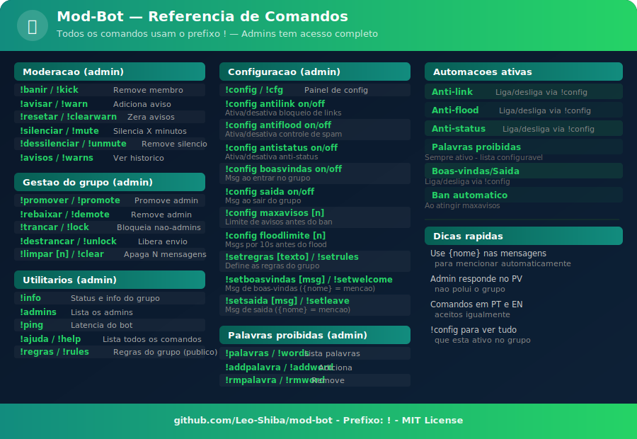

<div align="center">


<br/>

[](https://git.io/typing-svg)

<br/>

[](https://github.com/Leo-Shiba/mod-bot)
[](https://nodejs.org)
[](https://github.com/WhiskeySockets/Baileys)
[](https://github.com/termux/termux-app/releases/latest)
[](./LICENSE)

<br/>

[](https://github.com/Leo-Shiba/mod-bot/stargazers)
[](https://github.com/Leo-Shiba/mod-bot/network)

<br/>

> 🤖 **Bot completo de moderação de grupos WhatsApp, feito para rodar direto no celular via Termux.**
> Sem servidor. Sem mensalidade. Instala em minutos e funciona 24h no seu Android.

<br/>

[📥 Instalação](#-instalação-no-celular-android) · [⚙️ Comandos](#️-comandos) · [🤖 Automações](#-automações) · [🔧 Problemas](#-solução-de-problemas) · [📁 Estrutura](#-estrutura-do-projeto)

</div>

---

## ✨ O que o bot faz

<table>
<tr>
<td align="center" width="25%">

### 🛡️ Moderação
Banir · Avisar · Silenciar
Sistema de avisos automático
Ban ao atingir o limite

</td>
<td align="center" width="25%">

### 🤖 Automações
Anti-link · Anti-flood
Palavras proibidas
Boas-vindas e despedida

</td>
<td align="center" width="25%">

### 👥 Gestão
Promover · Rebaixar · Trancar
Regras · Limpeza em massa
Histórico de infrações

</td>
<td align="center" width="25%">

### 📊 Informações
Stats do grupo · Lista de admins
Histórico de avisos
Painel de configurações

</td>
</tr>
</table>

---

## 🖼️ Guia Visual de Comandos

<div align="center">



</div>

---

## 📲 Instalação no celular (Android)

<div align="center">


</div>

<br/>

### Pré-requisitos

<div align="center">

| ✅ | Requisito |
|:--:|:--|
| 📱 | Android 7.0 ou superior |
| 📦 | App **Termux** (via GitHub Releases — veja abaixo) |
| 🌐 | Conexão com internet |

</div>

---

###  &nbsp; Instalar o Termux

> [!WARNING]
> **Não use a Play Store** — a versão de lá é desatualizada e quebra a instalação.
> **Não use o F-Droid** — baixe diretamente pelo GitHub para garantir a versão mais recente e confiável.

Acesse no celular e instale o `.apk` mais recente:

**👉 https://github.com/termux/termux-app/releases/latest**

---

###  &nbsp; Atualizar e instalar dependências

Abra o **Termux** e rode os comandos abaixo, **um de cada vez**:

```bash
pkg update && pkg upgrade -y
```

```bash
pkg install nodejs git -y
```

```bash
node -v && git --version
```

> ✅ Se aparecer as versões do Node e do Git, está tudo certo!

---

###  &nbsp; Clonar o repositório

```bash
git clone https://github.com/Leo-Shiba/mod-bot.git && cd mod-bot
```

---

###  &nbsp; Instalar as dependências do bot

```bash
npm install
```

> ⏳ Pode demorar alguns minutos na primeira vez.

---

###  &nbsp; Iniciar o bot e escanear o QR Code

```bash
npm start
```

Um **QR Code** aparecerá no terminal. Para conectar:

```
WhatsApp → Configurações → Aparelhos conectados → Conectar aparelho
```

> [!TIP]
> ✅ Quando aparecer **"Conectado ao WhatsApp!"** o bot está online e pronto!

---

###  &nbsp; Manter o bot ligado (recomendado)

```bash
termux-wake-lock
```

> Isso impede o Android de encerrar o Termux com a tela apagada.

---

### 🔁 Religar o bot depois

```bash
cd mod-bot && npm start
```

Para encerrar: `Ctrl + C`

---

## ⚙️ Comandos

> Todos os comandos usam o prefixo `!`. Comandos em **PT** e **EN** são aceitos igualmente.

### 🔐 Moderação e Gestão (admins)

<div align="center">

| Comando | Alias EN | Descrição |
|:--|:--|:--|
| `!banir @membro` | `!kick` | Remove o membro do grupo |
| `!avisar @membro [motivo]` | `!warn` | Adiciona aviso (ao atingir o limite → ban) |
| `!resetar @membro` | `!clearwarn` | Zera os avisos de um membro |
| `!silenciar @membro [min]` | `!mute` | Silencia temporariamente |
| `!dessilenciar @membro` | `!unmute` | Remove o silêncio |
| `!promover @membro` | `!promote` | Torna o membro administrador |
| `!rebaixar @membro` | `!demote` | Remove a administração |
| `!trancar` | `!lock` | Bloqueia envio para não-admins |
| `!destrancar` | `!unlock` | Libera envio para todos |
| `!limpar [n]` | `!clear` | Apaga as últimas N mensagens (máx 50) |

</div>

### ⚙️ Configuração (admins)

<div align="center">

| Comando | Descrição |
|:--|:--|
| `!config` / `!cfg` | Painel de configurações do grupo |
| `!config antilink on/off` | Liga/desliga bloqueio de links |
| `!config antiflood on/off` | Liga/desliga controle de spam |
| `!config antistatus on/off` | Liga/desliga anti-status |
| `!config boasvindas on/off` | Liga/desliga mensagem de boas-vindas |
| `!config saida on/off` | Liga/desliga mensagem de despedida |
| `!config maxavisos <n>` | Define o limite de avisos antes do ban |
| `!config floodlimite <n>` | Msgs por 10s antes de acionar o anti-flood |
| `!setboasvindas <msg>` / `reset` | Personaliza a mensagem de entrada |
| `!setsaida <msg>` / `reset` | Personaliza a mensagem de saída |
| `!setregras <texto>` | Define as regras do grupo |
| `!palavras` | Lista palavras proibidas |
| `!addpalavra <palavra>` | Adiciona palavra à lista negra |
| `!rmpalavra <palavra>` | Remove palavra da lista negra |

</div>

### 🌐 Comandos Públicos

<div align="center">

| Comando | Alias EN | Descrição |
|:--|:--|:--|
| `!regras` | `!rules` | Mostra as regras do grupo |
| `!avisos [@membro]` | `!warns` | Consulta avisos de um membro |
| `!admins` | — | Lista os administradores |
| `!info` | — | Estatísticas do grupo |
| `!ping` | — | Latência do bot |
| `!ajuda` | `!help` | Lista todos os comandos |

</div>

---

## 🤖 Automações

<div align="center">

| Automação | Padrão | Comportamento |
|:--|:--:|:--|
| 👋 Boas-vindas | ✅ Ligado | Mensagem ao entrar no grupo |
| 🚪 Despedida | 🔴 Desligado | Mensagem ao sair do grupo |
| 🔗 Anti-link | 🔴 Desligado | Apaga mensagens com links |
| 💬 Anti-flood | 🔴 Desligado | Avisa quem envia mensagens rápido demais |
| 📸 Anti-status | 🔴 Desligado | Impede visualização de status automática |
| 🤬 Palavras proibidas | ✅ Sempre ativo | Apaga mensagens com palavras da lista negra |
| 🔨 Ban automático | ✅ Ativo | Bane ao atingir o limite de avisos (padrão: 3) |

</div>

### Personalizar mensagens

Use `{nome}` para mencionar o membro automaticamente:

```bash
!setboasvindas Bem-vindo(a) ao grupo, {nome}! Leia as !regras 📋
!setsaida Até mais, {nome}! Foi um prazer ter você aqui 👋
```

---

## 🔧 Solução de problemas

<details>
<summary><b>❓ QR Code não aparece ou expirou</b></summary>

```bash
rm -rf data/auth && npm start
```
</details>

<details>
<summary><b>❓ Bot parou de responder</b></summary>

```bash
cd mod-bot && npm start
```
O bot reconecta automaticamente na maioria dos casos.
</details>

<details>
<summary><b>❓ Erro "pkg: command not found"</b></summary>

Certifique-se de que está usando o **Termux do GitHub**, não da Play Store. Reinstale se necessário.
</details>

<details>
<summary><b>❓ Node.js muito antigo (erro no npm install)</b></summary>

```bash
pkg install nodejs-lts -y
```
</details>

<details>
<summary><b>❓ Bot encerrado com a tela apagada</b></summary>

Execute `termux-wake-lock` e configure o Termux como app sem restrição de bateria:
**Configurações → Aplicativos → Termux → Bateria → Sem restrições**
</details>

---

## 🧱 Estrutura do projeto

```
mod-bot/
│
├── 📄 index.js              # Núcleo: conexão, eventos, anti-flood, anti-link
├── 📄 launcher.js           # Inicializador com keep-alive
├── 📄 config.js             # Configurações gerais
│
├── 📂 core/
│   ├── commandHandler.js    # Carrega e processa comandos
│   ├── database.js          # Banco SQLite (avisos, config, grupos)
│   ├── seguranca.js         # Verificação de permissões
│   ├── notificar.js         # Notificações para o dono
│   ├── buffer.js            # Buffer de mensagens para !limpar
│   └── utils.js             # Funções utilitárias
│
├── 📂 commands/             # Um arquivo por comando
│   ├── ajuda.js
│   ├── avisar.js
│   ├── banir.js
│   └── ...
│
└── 📂 assets/               # Imagens e guias visuais
    ├── instalacao-banner.svg
    └── comandos-banner.svg
```

---

## 📦 Dependências

<div align="center">

| Pacote | Uso |
|:--|:--|
| [`@whiskeysockets/baileys`](https://github.com/WhiskeySockets/Baileys) | Conexão com WhatsApp Web |
| [`pino`](https://getpino.io) | Logger |
| [`qrcode-terminal`](https://github.com/gtanner/qrcode-terminal) | QR Code no terminal |
| [`better-sqlite3`](https://github.com/WiseLibs/better-sqlite3) | Banco de dados local |

</div>

---

## 📝 Licença

Distribuído sob a licença **MIT** — use, modifique e distribua à vontade.

---

<div align="center">

Feito com 🧡 por **[Leo-Shiba](https://github.com/Leo-Shiba)**

<br/>

[](https://github.com/Leo-Shiba)

<br/>


</div>
